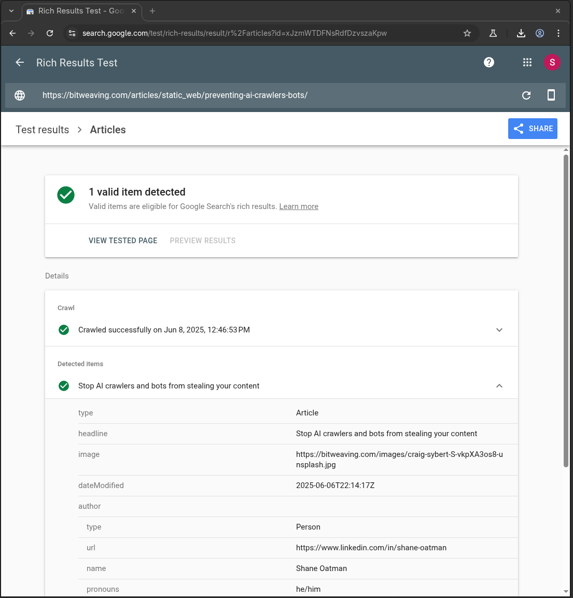
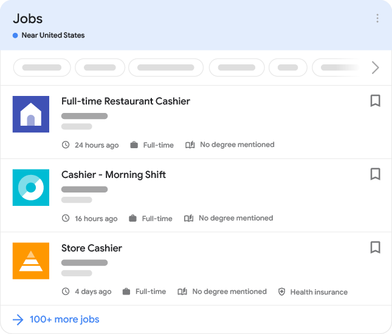

+++
title = "Structured data & enriched results"
authors = ["Shane Oatman"]
description = "Discusses how to include structured data in your site to improve SEO and take advantage of the enriched search results provided by search engines."
updated = "2025-06-06T22:14:17+00:00"
draft = false
[extra]
keywords = ["structured data", "schema.org", "article", "google search", "bing search", "json-ld", "ld-json", "enriched", "search", "results", "zola", "rust"]
image = "https://bitweaving.com/images/craig-sybert-S-vkpXA3os8-unsplash.jpg"
author = '''
{
      "@type": "Person",
      "url": "www.linkedin.com/in/shane-oatman",
      "name": "Shane Oatman",
      "pronouns": "he/him",
      "email": "shane@bitweaving.com"
}
'''
+++

# Introduction

Structured data is data included in an HTML page that conforms to the W3C schema.org project. Search engines use the structured data to enhance how your page appears in their search results. For example: a NewsArticle, JobPosting, Organization, Person, etc.

This article will provide information on:

- schema.org
- Examples of structured data using JSON-LD
- Google & Bing supported enriched results / schema types

## References

- [Google enriched search results](https://developers.google.com/search/docs/appearance/enriched-search-results)
- [Google enriched result test tool](https://search.google.com/test/rich-results)
- [Bing structured data support](https://www.bing.com/webmasters/help/marking-up-your-site-with-structured-data-3a93e731)
- [schema.org](https://schema.org)
- [JSON-LD Specification](https://www.w3.org/TR/json-ld11/)

## Schema of structured data

Structured data relies on the fields and object types defined by schema.org. Navigating to schema.org, you can search for anything that you are publishing on your page. The type of information presented on a particular web page usually maps to a schema.org type. A few examples for illustration purposes:

- CreativeWork, Article, TechArticle
- JobPosting
- Person
- Organization
- Product
- Event

> If the content of your page is novel and does not map to an existing schema.org type definition, there is a process by which to submit a proposal for a new type to the schema.org W3C community.

Schema.org uses polymorphism/inheritance with all types ultimately being derived from a Thing. If in your structured data you do not specify a specific type, search engines and other tools consuming your page will assume that a "Thing" is being described.
In the first example above, [CreativeWork](https://schema.org/CreativeWork) is derived from Thing, [Article](https://schema.org/Article) is derived from CreativeWork, and [TechArticle](https://schema.org/TechArticle) derives from Article. Schema.org provides examples for each type in a variety of different encodings (ways of including the structured data in the page) at the bottom of the type description page.

Here's an example of the JSON-LD encoding of an Article as defined in schema.org:
```html
<script type="application/ld+json">
{
  "@context": "https://schema.org",
  "@type": "Article",
  "author": "John Doe",
  "name": "How to Tie a Reef Knot"
}
</script>
```

An example from this page:

```html
<script type="application/ld+json">
  {
    "@context": "https://schema.org",
    "@type": "Article",
    "headline": "Structured data &amp; enriched results",
    "image": "https://bitweaving.com/images/craig-sybert-S-vkpXA3os8-unsplash.jpg",
    "dateModified": "2025-06-06T22:14:17+00:00",
    "author": {
      "@type": "Person",
      "url": "www.linkedin.com/in/shane-oatman",
      "name": "Shane Oatman",
      "pronouns": "he/him",
      "email": "shane@bitweaving.com"
    },
    "keywords": "[structured data, schema.org, article, google search, bing search, json-ld, ld-json, enriched, search, results, zola, rust]",
    "url": "http://127.0.0.1:1111/articles/static_web/structured-data/"
  }
</script>
```

## Verifying Structured data

Both Bing and Google have dedicated tools for verifying the structured data you include in your pages. In addition, Google provides a tool for verifying that your page is eligible for display as an enriched result.

For example:




## Enriched results

Enriched results are results for which there is structured data available such that the search engine can render a better user experience for the user of the search engine. This also allows the search engine to create dedicated experiences for things like news articles, job postings, and organizations. The better user experience may mean links to phone a business or contact a business by email, links to apply for a job, a link to get directions to an address for a business or event, etc.

In some cases, search engines like Google have a dedicated experience for searching for jobs based on structured data.


Here are a few examples of the enriched result experiences:

### Article


### Job Posting



### Event


## Summary

Structured data makes the content of your page more understandable to consumers, whether they are software or human agents. Your content management system or static site generator may support this natively, or you may have to opt in or support it yourself. In the case of this site, we use [Zola](https://www.getzola.org/) which does not have native support for it, but with template customization, it is simple to add yourself.

Hope you find this helpful!
